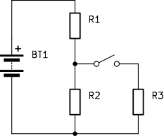

## Razumevanje električnih vezij

Razumevanje električnega vezja se pokaže v kvalitativni presoji, kako se njegove električne količine spremenijo, ko vanj vključimo dodatno vejo. Naslednji vprašalnik ni namenjen ocenjevanju znanja, temveč prepoznavanju vašega trenutnega miselnega modela električnega vezja. Pravilnih odgovorov na tej točki ni treba računati ali iskati v literaturi. Pri vsaki količini odgovorite na podlagi svojega trenutnega razumevanja; če spremembe ne morete presoditi, izberite možnost **ne vem**.

Po obravnavi vsebine skripte se boste k istemu vprašalniku ponovno vrnili. Takrat primerjajte predvsem način razmišljanja in razlage, s katero ste prišli do posamezne napovedi, ne le števila pravilnih odgovorov.

### Vezje in opazovana sprememba

Vezje na sliki sestavljajo idealni napetostni vir z napetostjo $U_0 = 9\,\mathrm{V}$, upor $R_1$, ki je vezan zaporedno s preostalim delom vezja, ter dve vzporedni veji za njim. V prvi veji je upor $R_2$, v drugi pa sta zaporedno vezana stikalo $S$ in upor $R_3$. Povezovalni vodniki in stikalo so idealni, upornosti vseh treh uporov pa so poljubne.

{#fig:diagnosticno-vezje-spremembe}

V začetnem stanju je stikalo $S$ razklenjeno, zato je veja z uporom $R_3$ prekinjena. Končno stanje opazujemo po sklenitvi stikala, ko je prehodni pojav že končan in se v vezju vzpostavi novo stacionarno stanje.

### Navodilo

Pri vsaki količini označite, ali se ob prehodu iz začetnega v končno stanje **poveča**, **zmanjša** ali se količina **ne spremeni**. Če spremembe na podlagi trenutnega razumevanja ne morete presoditi, označite **ne vem**. Vprašalnik zahteva kvalitativno analizo; numerično računanje ni potrebno.

| Električna količina                    | Poveča | Zmanjša | Ne spremeni | Ne vem |
|----------------------------------------|:------:|:-------:|:-----------:|:------:|
| Napetost idealnega vira $U_0$          |        |         |             |        |
| Upornost $R_1$                         |        |         |             |        |
| Upornost $R_2$                         |        |         |             |        |
| Upornost $R_3$                         |        |         |             |        |
| Skupna upornost celotnega vezja        |        |         |             |        |
| Tok skozi napetostni vir               |        |         |             |        |
| Tok skozi upor $R_1$                   |        |         |             |        |
| Tok skozi upor $R_2$                   |        |         |             |        |
| Tok skozi upor $R_3$                   |        |         |             |        |
| Napetost na uporu $R_1$                |        |         |             |        |
| Napetost na uporu $R_2$                |        |         |             |        |
| Napetost na uporu $R_3$                |        |         |             |        |
| Moč na uporu $R_1$                     |        |         |             |        |
| Moč na uporu $R_2$                     |        |         |             |        |
| Moč na uporu $R_3$                     |        |         |             |        |
| Moč, ki jo vezju oddaja napetostni vir |        |         |             |        |

Table: Tabela sprememb električnih količin ob vključitvi stikala. {#tbl:pravilnostna_tabela_sprememb}

### Kratka refleksija

Po izpolnjevanju si na kratko zabeležite, pri katerih količinah ste odgovorili samozavestno in pri katerih ste izbrali možnost **ne vem**. Razmislite še, ali ste vezje analizirali kot celoto ali ste posamezne elemente obravnavali ločeno ter katera začetna predstava vas je vodila pri odločanju.

