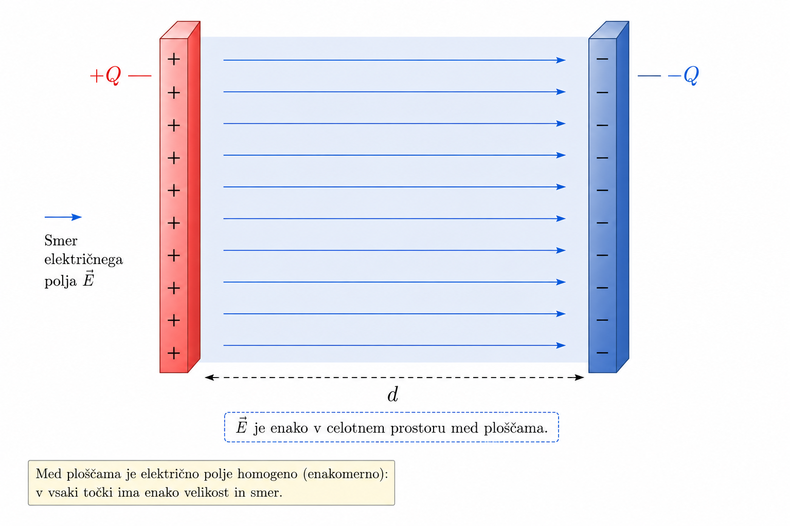
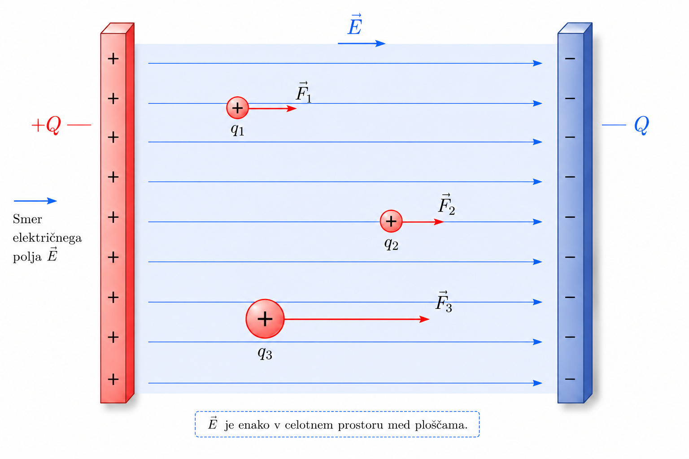
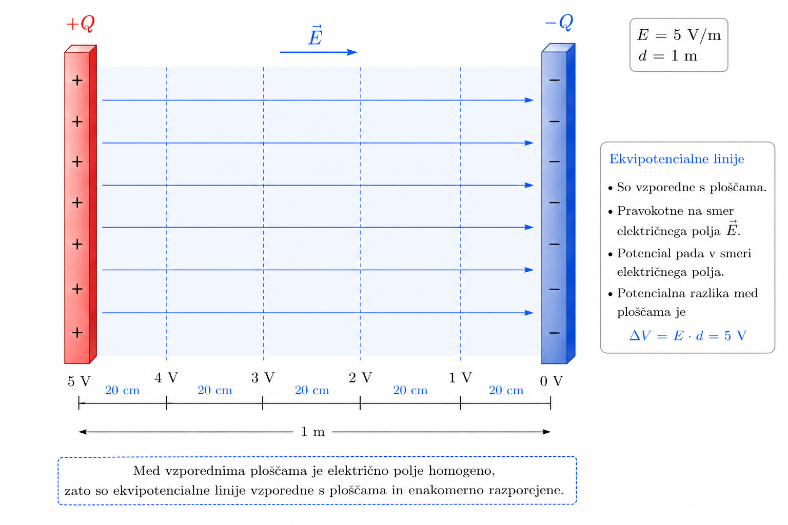

## Električni potencial

V prejšnjem podpoglavju smo ugotovili, da električno polje deluje na električni naboj s silo. Če je naboj prost, ga sila pospeši in povzroči njegovo gibanje. Pri tem se postavi novo vprašanje. Kako električno polje pri premiku naboja opravlja delo in kako to povezavo opišemo z električno potencialno energijo?

Za odgovor na to vprašanje si oglejmo preprost primer homogenega električnega polja med dvema velikima vzporednima ploščama (slika @fig:parallel_plates). Takšno polje nastane, če eno ploščo nabijemo pozitivno, drugo pa negativno. Med ploščama so silnice električnega polja približno vzporedne, zato lahko predpostavimo, da je jakost električnega polja v celotnem prostoru med njima enaka [@griffiths2017].

{#fig:parallel_plates width=70%}

V električno polje postavimo pozitiven preizkusni naboj $q$. Na naboj deluje sila

$$
\mathbf{F}=q\mathbf{E}.
$$ {#eq:force_field}

Če se naboj zaradi delovanja sile premakne za razdaljo $s$, električno polje opravi delo

$$
A_e=Fs.
$$ {#eq:work}

Ker v homogenem električnem polju velja enačba @eq:force_field, lahko delo zapišemo tudi kot

$$
\begin{aligned}
A_e &= Fs \\
    &= qEs.
\end{aligned}
$$ {#eq:work_field}

Iz enačbe @eq:work_field sledi pomembna ugotovitev. Potencialna energija naboja ni odvisna le od lege v električnem polju, temveč tudi od velikosti naboja.

To lahko pokažemo s primerjavo treh preizkusnih nabojev na @fig:charge_comparison.

Najprej primerjajmo naboja $q_1$ in $q_2$. Naboja sta enako velika, vendar sta različno oddaljena od negativne plošče $-Q$. Ker je električno polje med ploščama homogeno, na oba deluje enako velika sila. Naboj $q_1$ je od negativne plošče bolj oddaljen, zato bi električno polje pri njegovem premiku do te plošče opravilo delo na daljši poti. Glede na negativno ploščo ima zato $q_1$ večjo električno potencialno energijo kot $q_2$.

Nato primerjajmo naboja $q_1$ in $q_3$, ki sta enako oddaljena od negativne plošče, vendar je $q_3$ večji. Ker je sila električnega polja odvisna od velikosti naboja, na $q_3$ deluje večja sila. Pri premiku po enako dolgi poti bi zato električno polje nad $q_3$ opravilo več dela, njegova električna potencialna energija glede na negativno ploščo pa je večja.

{#fig:charge_comparison width=75%}

Oba primera razkrivata pomembno lastnost potencialne energije. Njena vrednost je odvisna od **dveh** neodvisnih dejavnikov:

- lege v električnem polju,
- velikosti električnega naboja.

To pomeni, da potencialna energija ni najprimernejša količina za opis električnega polja. Če bi na isto mesto postavili dvakrat večji naboj, bi bila njegova potencialna energija dvakrat večja, čeprav se električno polje ni prav nič spremenilo.

V elektrotehniki želimo opisati predvsem električno polje oziroma energijske razmere v prostoru, ne pa energije posameznega preizkusnega naboja. Zato uvedemo novo fizikalno količino, ki potencialno energijo normira glede na velikost naboja.

Električni potencial definiramo kot potencialno energijo na enoto električnega naboja

$$
V=\frac{W_p}{q}.
$$ {#eq:potential}

Iz enačbe @eq:potential sledi, da električni potencial ni več odvisen od velikosti preizkusnega naboja, temveč le od njegove lege v električnem polju. Električni potencial je zato lastnost prostora, ki ga ustvari električno polje, in ne lastnost posameznega naboja.

Točke z enakim električnim potencialom tvorijo **ekvipotencialne ploskve**. V homogenem električnem polju med dvema vzporednima ploščama so to ravnine, vzporedne s ploščama (slika @fig:equipotential). Pri premikanju naboja po isti ekvipotencialni ploskvi električno polje ne opravi nobenega dela, saj se potencialna energija naboja ne spremeni.

{#fig:equipotential width=75%}

Električni potencial predstavlja eno najpomembnejših fizikalnih količin v elektrotehniki. Vsaki točki električnega polja lahko pripišemo natanko eno vrednost potenciala, ne glede na to, kakšen preizkusni naboj uporabimo. V naslednjem podpoglavju bomo pokazali, da pri električnih vezjih običajno ne primerjamo absolutnih vrednosti električnega potenciala, temveč razliko potencialov med dvema točkama, ki jo imenujemo **električna napetost**.

