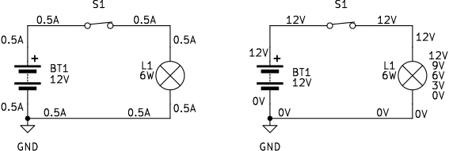
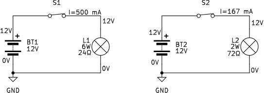

## Električna upornost in pretvorba energije

V prejšnjem podpoglavju smo ugotovili, da električni tok predstavlja usmerjeno gibanje električnih nabojev. Na preprostem električnem vezju, sestavljenem iz baterije, stikala in žarnice, lahko opazimo dve pomembni lastnosti (@fig:potencial-zarnica). Na levi strani slike je prikazano, da skozi vse elemente zaporednega vezja teče enak električni tok, v našem primeru $0,5\,\mathrm{A}$. Na desni strani iste slike pa so prikazani električni potenciali v različnih točkah vezja. Opazimo, da električni potencial na povezovalnih vodnikih ostaja skoraj nespremenjen, izrazito pa se zmanjša na žarnici.

{#fig:potencial-zarnica width=95%}

To opažanje odpira pomembno vprašanje. Če skozi povezovalni vodnik in skozi žarnico teče popolnoma enak električni tok, zakaj se električni potencial zmanjša le na žarnici? Iz samega električnega toka torej očitno ne moremo sklepati, ali se bo električni potencial na posameznem elementu zmanjšal ali ne. Od česa je torej odvisno zmanjšanje električnega potenciala?

Odgovor lahko poiščemo v definiciji električnega potenciala, ki smo jo spoznali v prejšnjem podpoglavju. Električni potencial predstavlja električno potencialno energijo na enoto naboja. Če se električni potencial na nekem elementu zmanjša, se na njem zmanjša tudi električna potencialna energija na enoto naboja.

Zato se moramo vprašati, v kaj se na žarnici pretvarja električna energija.

Vir napetosti v sklenjenem vezju vzpostavi električno polje, ki povzroči usmerjeno gibanje nosilcev naboja. Na žarilni nitki se električna energija pretvarja v toploto in svetlobo. Ker na žarnici poteka pretvorba električne energije v druge oblike, se na njej zmanjša električni potencial. To zmanjšanje pomeni zmanjšanje električne potencialne energije na enoto naboja.

Na povezovalnih vodnikih je takšna pretvorba energije praviloma zanemarljiva. Njihova naloga je povezovanje posameznih elementov električnega vezja, zato ostane električni potencial vzdolž idealiziranih vodnikov skoraj nespremenjen.

Iz tega lahko oblikujemo pomembno ugotovitev.

> Električni potencial se zmanjšuje predvsem na tistih elementih električnega vezja, kjer se električna energija pretvarja v druge oblike energije ali opravlja delo.

Električno polje v različnih električnih elementih ne povzroči enako učinkovitega usmerjenega gibanja nosilcev naboja. Pri isti potencialni razliki skozi nekatere elemente v enakem času preide več naboja, skozi druge pa manj. Lastnost elementa, ki opisuje, kako močno element omejuje usmerjeno gibanje nosilcev naboja, imenujemo **električna upornost**.

Manjša električna upornost pomeni, da lahko električno polje pri isti potencialni razliki povzroči večji električni tok, zato skozi element v enakem času preide več naboja. Obratno velja, da je za enak električni tok skozi element z manjšo upornostjo potrebna manjša potencialna razlika. Ker potencialna razlika opisuje spremembo električne potencialne energije na enoto naboja, se pri prehodu enake količine naboja skozi tak element pretvori manj energije. Električno upornost označujemo s simbolom $R$, njena osnovna enota pa je **ohm** ($\Omega$).

### Primerjava žarnic z različno upornostjo

Primerjavo dveh ločenih vezij prikazuje @fig:primerjava-upornosti-zarnic. V vsakem so zaporedno povezani baterija z napetostjo $12\,\mathrm{V}$, stikalo in žarnica. Prva žarnica ima pri tej napetosti moč $6\,\mathrm{W}$ in upornost $24\,\Omega$, druga pa moč $2\,\mathrm{W}$ in upornost $72\,\Omega$. Ko stikali sklenemo, je na vsaki žarnici enaka potencialna razlika $12\,\mathrm{V}$. Električni potencial se torej na obeh žarnicah zmanjša za enako vrednost, meritev toka pa pokaže pomembno razliko: skozi prvo vezje teče tok $0{,}50\,\mathrm{A}$, skozi drugo pa približno $0{,}17\,\mathrm{A}$.

{#fig:primerjava-upornosti-zarnic width=95%}

Ker potencialna razlika opisuje spremembo električne potencialne energije na enoto naboja, se pri prehodu skozi vsako žarnico na en kulon naboja pretvori $12\,\mathrm{J}$ električne energije. Razlika med žarnicama ni v pretvorjeni energiji na enoto naboja, temveč v količini naboja, ki preide skozi njiju v eni sekundi. Skozi žarnico z upornostjo $24\,\Omega$ vsako sekundo preide $0{,}50\,\mathrm{C}$ naboja, skozi žarnico z upornostjo $72\,\Omega$ pa približno $0{,}17\,\mathrm{C}$. Skozi prvo žarnico torej v istem času preide trikrat več naboja, zato se v njej vsako sekundo pretvori trikrat več električne energije. Njena moč je zato $6\,\mathrm{W}$, moč druge žarnice pa $2\,\mathrm{W}$.

Vir napetosti v obeh sklenjenih vezjih vzpostavi električno polje, ki povzroči usmerjeno gibanje nosilcev naboja. Pri enaki potencialni razliki se nosilci naboja skozi žarnico z manjšo upornostjo gibljejo učinkoviteje, zato je električni tok večji. Pri tem primerjamo enako potencialno razliko na žarnicah; lokalna jakost in porazdelitev električnega polja v različnih žarilnih nitkah nista nujno povsod enaki.

V vsakem posameznem vezju teče skozi vse zaporedno povezane elemente enak tok. V prvem vezju zato skozi vsak prečni prerez povezovalnih žic in skozi žarnico vsako sekundo preide $0{,}50\,\mathrm{C}$ naboja, v drugem pa približno $0{,}17\,\mathrm{C}$. Povezovalne žice imajo mnogo manjšo upornost od žarilne nitke, zato za vzdrževanje istega toka v njih zadostuje mnogo manjša jakost električnega polja. Posledično je zmanjšanje potenciala vzdolž žic zelo majhno, z njim pa je zelo majhna tudi pretvorba električne energije na enoto naboja. V idealiziranem vezju upornost žic zanemarimo, zato jim pripišemo enak potencial po vsej dolžini.

Na žarilni nitki je upornost bistveno večja. Za isti tok je zato potrebna večja potencialna razlika, na žarnici pa se skoraj vsa razpoložljiva električna energija pretvori v toploto in svetlobo. V obeh obravnavanih vezjih se na žarnici pretvori $12\,\mathrm{J}$ energije na kulon naboja, na povezovalnih žicah pa le zanemarljiv delež te vrednosti.

Ker se na električnih elementih električna energija pretvarja v druge oblike energije, nas zanima tudi, kako hitro ta pretvorba poteka. To opisuje **električna moč**. Električna moč je hitrost pretvarjanja električne energije in jo določimo kot produkt električne napetosti na elementu in električnega toka skozenj

$$
P = UI
$$
{#eq:elektricna-moc}

Večja kot je električna moč, hitreje se električna energija pretvarja v toploto, svetlobo, mehansko delo ali druge oblike energije.

V tem podpoglavju smo ugotovili, da električni tok sam po sebi še ne določa, ali se bo električni potencial na posameznem elementu zmanjšal. Zmanjšanje električnega potenciala je povezano s pretvorbo električne energije, električna upornost pa opisuje, kako močno element omejuje usmerjeno gibanje nosilcev naboja. Pri tem pa ostaja odprto še eno pomembno vprašanje. Kako so električni tok, električna napetost in električna upornost med seboj povezani? Ali lahko iz poznavanja dveh količin določimo tretjo? In kako lahko električne napetosti ter tokove določimo tudi v zahtevnejših električnih vezjih z več elementi? Na ta vprašanja bomo odgovorili v naslednjem poglavju, kjer bomo spoznali **Ohmov zakon** kot temeljno zvezo med električno napetostjo, električnim tokom in električno upornostjo. Na tej osnovi bomo nato razvili še **Kirchhoffova zakona**, ki omogočata sistematično analizo tudi zahtevnejših električnih vezij.

