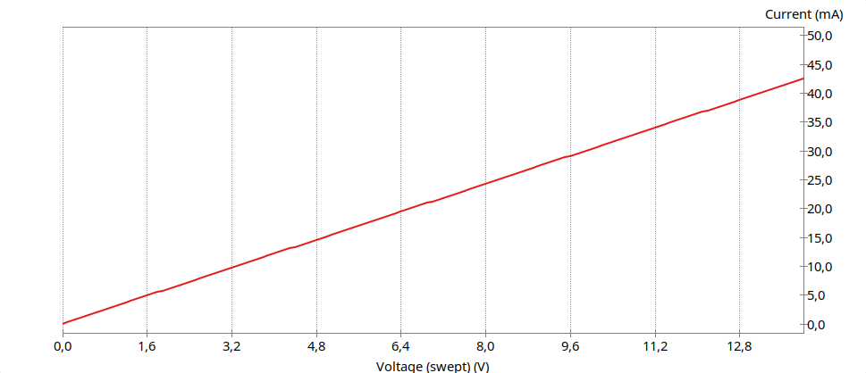
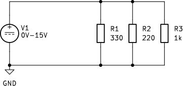
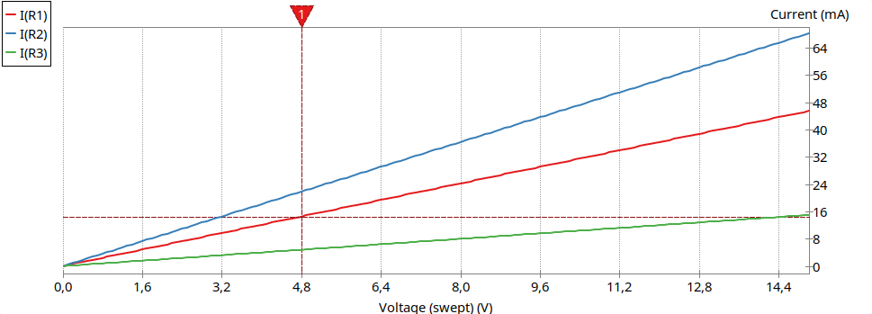

## Ohmov zakon

Sestavimo vezje, prikazano na sliki @fig:ohm_experiment. Vezje sestavljajo nastavljiv enosmerni napetostni vir, upor, ampermeter in voltmeter. Napetost med priključkoma upora merimo z voltmetrom, električni tok skozi upor pa z ampermetrom.

Napetost na uporu definiramo kot razliko električnih potencialov med priključkoma upora (enačba @eq:napetost-na-uporu):

$$
U_R=V_{+}-V_{-},
$$ {#eq:napetost-na-uporu}

V enačbi @eq:napetost-na-uporu je $V_{+}$ električni potencial na priključku, skozi katerega tok vstopa v upor, $V_{-}$ pa električni potencial na priključku, skozi katerega tok iz upora izstopa.

Napetost nastavljivega vira nato postopoma povečujemo. Pri vsaki nastavitvi izmerimo električni tok skozi upor in rezultate zapišemo v preglednico @tbl:ohm_measurements.

| Meritev | Napetost $U_R$ [V] | Tok $I$ [mA] |
| :-----: | -----------------: | -----------: |
| 1       | 0,00               | 0,00         |
| 2       | 1,98               | 6,00         |
| 3       | 3,99               | 12,09        |
| 4       | 6,01               | 18,19        |
| 5       | 7,97               | 24,11        |
| 6       | 10,03              | 30,42        |
| 7       | 11,98              | 36,31        |

Table: Izmerjeni električni tok skozi upor z upornostjo $330\,\Omega$ pri različnih napetostih na uporu. {#tbl:ohm_measurements}

Na podlagi izmerjenih podatkov narišemo graf električnega toka v odvisnosti od napetosti na uporu (slika @fig:ohm_graph).

{#fig:ohm_graph width=90%}

Iz grafa opazimo dve pomembni lastnosti:

1. električni tok narašča z naraščajočo napetostjo. Večja kot je razlika električnih potencialov med priključkoma upora, večji električni tok steče skozi upor.

2. Vse izmerjene točke ležijo na premici, ki poteka skozi koordinatno izhodišče. To pomeni, da sta električni tok in napetost med priključkoma upora **premo sorazmerna**. Če napetost podvojimo, se podvoji tudi električni tok. Če napetost potrojimo, se potroji tudi električni tok.

Ker je na navpični osi grafa električni tok $I$, na vodoravni osi pa napetost $U_R$, smerni koeficient premice določimo z enačbo @eq:smerni-koeficient-iu:

$$
k=\frac{\Delta I}{\Delta U_R}.
$$ {#eq:smerni-koeficient-iu}

V enačbi @eq:smerni-koeficient-iu je $\Delta I$ sprememba električnega toka, $\Delta U_R$ pa pripadajoča sprememba napetosti na uporu. Ker premica poteka skozi koordinatno izhodišče, lahko njen smerni koeficient zapišemo tudi kot $k=I/U_R$. Povezavo med smernim koeficientom in električno upornostjo podaja enačba @eq:smerni-koeficient-upornost:

$$
k=\frac{1}{R}.
$$ {#eq:smerni-koeficient-upornost}

Iz enačbe @eq:smerni-koeficient-upornost je razvidno, da manjša upornost pomeni večji smerni koeficient: električni tok se pri povečevanju napetosti povečuje hitreje. Večja upornost pa pomeni manjši smerni koeficient in manjši tok pri isti napetosti. Električno upornost označujemo z $R$, njena enota je ohm ($\Omega$).

**Ohmov zakon zato zapisujemo v obliki, podani z enačbo @eq:ohmov-zakon:**

$$
I=\frac{U_R}{R}.
$$ {#eq:ohmov-zakon}

Zapis enačbe @eq:ohmov-zakon jasno pokaže, da je električni tok $I$ **odvisna spremenljivka**. Njegova vrednost je odvisna od napetosti $U_R$ med priključkoma elementa in njegove upornosti $R$. Razlika električnih potencialov med priključkoma je pogoj, da se v elementu vzpostavi električno polje. Električno polje deluje na nosilce naboja in povzroči njihovo usmerjeno gibanje, ki ga opišemo z električnim tokom. Če med priključkoma upora ni napetosti, ni usmerjenega gibanja nosilcev naboja in je električni tok enak nič.

### Vpliv upornosti na električni tok

Vpliv upornosti na električni tok primerjamo z vezjem na sliki @fig:ohm_vezje_razlicne_upornosti. Na nastavljivi napetostni vir so vzporedno priključeni trije upori: $R_1=330\,\Omega$, $R_2=220\,\Omega$ in $R_3=1\,\mathrm{k}\Omega$. Ker je vsak upor priključen med isti dve točki vezja, je na vseh treh uporih enaka napetost.

{#fig:ohm_vezje_razlicne_upornosti width=55%}

Ko napetost vira postopoma povečujemo, za vsak upor spremljamo električni tok. Dobljene karakteristike prikazuje slika @fig:ohm_razlicne_upornosti.

{#fig:ohm_razlicne_upornosti width=90%}

Za primerjavo izberemo napetost $U_R=4{,}8\,\mathrm{V}$, ki je na sliki označena z navpično črtkano črto. Pri tej napetosti teče skozi upor z upornostjo $220\,\Omega$ tok približno $21{,}8\,\mathrm{mA}$, skozi upor z upornostjo $330\,\Omega$ približno $14{,}5\,\mathrm{mA}$, skozi upor z upornostjo $1\,\mathrm{k}\Omega$ pa $4{,}8\,\mathrm{mA}$. Primerjava pokaže, da pri enaki napetosti manjša upornost pomeni večji električni tok.

Pomembno je poudariti, da Ohmov zakon ne velja za vse električne elemente na celotni njihovi $I(U)$ karakteristiki. Velja le za elemente, pri katerih je pri nespremenjeni temperaturi električni tok premo sorazmeren z napetostjo med priključkoma. Takšne elemente imenujemo **ohmski elementi** ali **linearni elementi**. Kovinski upori so dober približek ohmskega elementa, medtem ko številni drugi elementi, na primer diode, svetleče diode in tranzistorji, tej zakonitosti ne sledijo.
