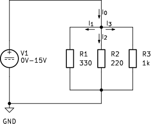
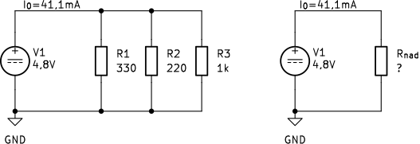

## Prvi Kirchhoffov izrek

Na sliki @fig:ohm_razlicne_upornosti smo primerjali tokove skozi tri vzporedno vezane upore. Tokovi $I_1$, $I_2$ in $I_3$ so različni, ker imajo veje različne upornosti. Pripadajoče vezje je na sliki @fig:kirchhoff-vozlisce-vzporedna-vezava preurejeno tako, da je razcep tokov jasno viden. Tok $I_0$ po vodniku s severne strani priteka v skupno vozlišče, iz njega pa odtekajo tokovi $I_1$, $I_2$ in $I_3$ skozi posamezne upore.

{#fig:kirchhoff-vozlisce-vzporedna-vezava width=55%}

**Vozlišče** je mesto v vezju, kjer se stikajo tri ali več prevodnih poti in je na električnih shemah praviloma jasno označeno s piko.

Tok, ki priteče do vozlišča, se razdeli med tri veje. Skozi vejo z manjšo upornostjo teče pri isti napetosti večji tok, skozi vejo z večjo upornostjo pa manjši tok. Vendar različne vrednosti tokov ne pomenijo, da del naboja v vozlišču izgine ali v njem zastane. Izhajamo iz predpostavke, da se v vozlišču električni naboj ne more kopičiti. Če bi v vozlišče pritekalo več naboja, kot bi ga iz njega odtekalo, bi se naboj kopičil in električni potencial vozlišča bi se zvišal, to pa se ne zgodi. V istem časovnem intervalu mora zato iz vozlišča odteči prav toliko naboja, kolikor ga vanj priteče.

Če v časovnem intervalu $\Delta t$ v vozlišče priteče naboj $\Delta Q_0$, mora v istem intervalu iz njega odteči skupni naboj $\Delta Q_1+\Delta Q_2+\Delta Q_3$. Hitrost dotekanja naboja je zato enaka skupni hitrosti njegovega odtekanja, kar opisuje enačba @eq:ravnovesje-naboja-vozlisce:

$$
\frac{\Delta Q_0}{\Delta t}
=
\frac{\Delta Q_1+\Delta Q_2+\Delta Q_3}{\Delta t}.
$$ {#eq:ravnovesje-naboja-vozlisce}

Električni tok je hitrost prehajanja naboja skozi presek vodnika, zato tokove v posameznih vodnikih opišemo z enačbami @eq:definicije-tokov-vozlisce:

$$
\begin{aligned}
I_0 &= \frac{\Delta Q_0}{\Delta t},&
I_1 &= \frac{\Delta Q_1}{\Delta t},&
I_2 &= \frac{\Delta Q_2}{\Delta t},&
I_3 &= \frac{\Delta Q_3}{\Delta t}.
\end{aligned}
$$ {#eq:definicije-tokov-vozlisce}

Ko izraze iz enačb @eq:definicije-tokov-vozlisce vstavimo v enačbo @eq:ravnovesje-naboja-vozlisce, dobimo enačbo @eq:kirchhoff-vozlisce-tri-veje:

$$
I_0=I_1+I_2+I_3.
$$ {#eq:kirchhoff-vozlisce-tri-veje}

Enačba @eq:kirchhoff-vozlisce-tri-veje pove, da je tok pred razcepom enak vsoti tokov po posameznih vejah. Tok se v vozlišču ne porablja. Razdeli se le usmerjeno gibanje naboja med razpoložljive prevodne poti.

Ugotovitev lahko razširimo na poljubno vozlišče:

> **Prvi Kirchhoffov izrek:** vsota tokov, ki pritekajo v vozlišče, je enaka vsoti tokov, ki iz vozlišča odtekajo.

Matematični zapis prvega Kirchhoffovega izreka podaja enačba @eq:prvi-kirchhoffov-izrek:

$$
\sum I_\mathrm{in}
=
\sum I_\mathrm{out}.
$$ {#eq:prvi-kirchhoffov-izrek}

V enačbi @eq:prvi-kirchhoffov-izrek indeks $\mathrm{in}$ označuje pritekajoče, indeks $\mathrm{out}$ pa odtekajoče tokove. Pri računanju pogosto vnaprej izberemo predznake tokov. Če pritekajočim tokovom pripišemo pozitivni, odtekajočim pa negativni predznak, lahko isti izrek zapišemo v obliki enačbe @eq:kirchhoff-predznaceni-tokovi:

$$
\sum_{k=1}^{n} I_k=0.
$$ {#eq:kirchhoff-predznaceni-tokovi}

V našem miselnem preskusu tok $I_0$ priteka v vozlišče, tokovi $I_1$, $I_2$ in $I_3$ pa iz njega odtekajo. Če pritekajočemu toku pripišemo pozitivni, odtekajočim tokovom pa negativni predznak, dobi enačba @eq:kirchhoff-predznaceni-tokovi konkretno obliko @eq:kirchhoff-predznaceni-primer:

$$
I_0-I_1-I_2-I_3=0.
$$ {#eq:kirchhoff-predznaceni-primer}

Enačbi @eq:kirchhoff-predznaceni-tokovi in @eq:kirchhoff-predznaceni-primer ne zahtevata, da dejansko smer vsakega toka poznamo vnaprej. Smer lahko predpostavimo. Če pri izračunu dobimo negativno vrednost toka, to pomeni, da tok v resnici teče v nasprotni smeri od izbrane.

Pri napetosti $4{,}8\,\mathrm{V}$ smo za tri vzporedno vezane upore določili tokove približno $14{,}5\,\mathrm{mA}$ skozi $R_1=330\,\Omega$, $21{,}8\,\mathrm{mA}$ skozi $R_2=220\,\Omega$ in $4{,}8\,\mathrm{mA}$ skozi $R_3=1\,\mathrm{k}\Omega$. Tok $I_0$, ki priteka v skupno vozlišče, zato določimo z enačbo @eq:vsota-tokov-primer:

$$
I_0
=
14{,}5\,\mathrm{mA}
+21{,}8\,\mathrm{mA}
+4{,}8\,\mathrm{mA}
\approx
41{,}1\,\mathrm{mA}.
$$ {#eq:vsota-tokov-primer}

Rezultat enačbe @eq:vsota-tokov-primer lahko preverimo tako, da z ampermetrom izmerimo tok pred vozliščem in ga primerjamo z vsoto tokov, izmerjenih v vseh treh vejah. S tem konkretno preverimo posledico ohranitve električnega naboja.

### Nadomestna upornost vzporedno vezanih uporov

Kompleksnejša električna vezja lahko pogosto poenostavimo tako, da skupino elementov nadomestimo z enim samim elementom. S tem postane delovanje vezja preglednejše, poenostavijo pa se tudi izračuni pri njegovem načrtovanju. Pri takšni zamenjavi moramo paziti, da se električne razmere v preostalem vezju ne spremenijo.

Prvotna in poenostavljena vezava morata biti na svojih zunanjih priključkih **električno enakovredni**. To pomeni, da morata pri enakih električnih potencialih priključnih vozlišč oziroma pri enaki napetosti $U$ iz vira prejemati enak skupni tok $I_0$. Posamezni tokovi znotraj nadomeščenega dela vezja se v poenostavljenem modelu ne ohranijo, navzven pa se mora vezje odzivati enako.

Na sliki @fig:nadomestna-upornost-vzporedna-vezava je vzporedna vezava treh uporov nadomeščena z enim uporom $R_\mathrm{nad}$. V obeh primerih je napetost vira $4{,}8\,\mathrm{V}$, skupni tok pa $41{,}1\,\mathrm{mA}$, zato vir med vezavama ne zazna razlike.

{#fig:nadomestna-upornost-vzporedna-vezava width=85%}

**Nadomestna upornost** $R_\mathrm{nad}$ je torej upornost enega upora, ki za preostalo vezje ustvari enake zunanje električne razmere kot prvotna skupina uporov.

Za nadomestni upor in posamezne veje uporabimo Ohmov zakon. Tokove podajajo enačbe @eq:tokovi-vzporedna-vezava:

$$
\begin{aligned}
I_0 &= \frac{U}{R_\mathrm{nad}},\\
I_1 &= \frac{U}{R_1},\\
I_2 &= \frac{U}{R_2},\\
I_3 &= \frac{U}{R_3}.
\end{aligned}
$$ {#eq:tokovi-vzporedna-vezava}

V enačbah @eq:tokovi-vzporedna-vezava je $R_\mathrm{nad}$ nadomestna upornost celotne vzporedne vezave. Ker so vsi upori priključeni med isti dve vozlišči, je na vsakem enaka napetost $U$. Prvi Kirchhoffov izrek @eq:kirchhoff-vozlisce-tri-veje zahteva, da je skupni tok enak vsoti tokov po vejah. Ko tokove iz enačb @eq:tokovi-vzporedna-vezava vstavimo v prvi Kirchhoffov izrek, dobimo enačbo @eq:izpeljava-vzporedna-upornost:

$$
\frac{U}{R_\mathrm{nad}}
=
\frac{U}{R_1}
+\frac{U}{R_2}
+\frac{U}{R_3}.
$$ {#eq:izpeljava-vzporedna-upornost}

Ker je napetost $U$ skupna vsem členom enačbe @eq:izpeljava-vzporedna-upornost, jo lahko krajšamo. Tako dobimo izraz za nadomestno upornost treh vzporedno vezanih uporov:

$$
\frac{1}{R_\mathrm{nad}}
=
\frac{1}{R_1}
+\frac{1}{R_2}
+\frac{1}{R_3}.
$$ {#eq:nadomestna-upornost-trije-vzporedno}

Enačbo @eq:nadomestna-upornost-trije-vzporedno lahko posplošimo na poljubno število vzporedno vezanih uporov. Splošni izraz podaja enačba @eq:nadomestna-upornost-vzporedno:

$$
\frac{1}{R_\mathrm{nad}}
=
\sum_{k=1}^{n}\frac{1}{R_k}.
$$ {#eq:nadomestna-upornost-vzporedno}

Za upore s slike @fig:kirchhoff-vozlisce-vzporedna-vezava iz enačbe @eq:nadomestna-upornost-vzporedno izračunamo:

$$
R_\mathrm{nad}
=
\left(
\frac{1}{330\,\Omega}
+\frac{1}{220\,\Omega}
+\frac{1}{1000\,\Omega}
\right)^{-1}
\approx
116{,}6\,\Omega.
$$ {#eq:nadomestna-upornost-primer}

Rezultat enačbe @eq:nadomestna-upornost-primer je manjši od najmanjše posamezne upornosti v vezavi. To je sprva lahko presenetljivo: z dodajanjem upora se nadomestna upornost ne poveča, temveč zmanjša. Nova vzporedna veja namreč električnemu polju omogoči še eno prevodno pot za usmerjeno gibanje nosilcev naboja. Pri isti napetosti zato iz vira teče večji skupni tok, kar po Ohmovem zakonu pomeni manjšo nadomestno upornost.

Dobljeni rezultat lahko preverimo še z vidika vira. Pri napetosti $4{,}8\,\mathrm{V}$ skozi nadomestni upor $116{,}6\,\Omega$ teče skupni tok $I_0\approx41{,}2\,\mathrm{mA}$, kar se ob upoštevanju zaokroževanja ujema z vsoto tokov po vejah v enačbi @eq:vsota-tokov-primer. Nadomestni upor zato za vir res predstavlja enake električne pogoje kot prvotna vzporedna vezava.
