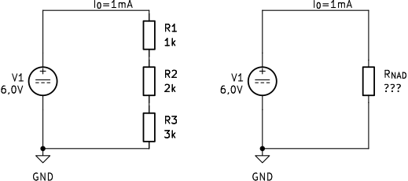

## Drugi Kirchhoffov izrek

Pri prvem Kirchhoffovem izreku smo opazovali, kaj se dogaja s tokom v vozlišču. Zdaj pozornost preusmerimo na električni potencial vzdolž sklenjene poti. Sestavimo vezje z napetostnim virom $U_0=6{,}0\,\mathrm{V}$ in tremi zaporedno vezanimi upori $R_1=1\,\mathrm{k}\Omega$, $R_2=2\,\mathrm{k}\Omega$ in $R_3=3\,\mathrm{k}\Omega$, kot prikazuje slika @fig:potenciali-zaporedno-vezje. Negativni priključek vira izberemo kot referenčno točko s potencialom $0\,\mathrm{V}$.

{#fig:potenciali-zaporedno-vezje width=75%}

Pri prehodu skozi napetostni vir od negativnega proti pozitivnemu priključku se električni potencial poveča z $V_A=0\,\mathrm{V}$ na $V_B=6\,\mathrm{V}$. Na uporu $R_1$ se zmanjša za $1\,\mathrm{V}$, zato je $V_C=5\,\mathrm{V}$. Na uporu $R_2$ se zmanjša še za $2\,\mathrm{V}$, zato je $V_D=3\,\mathrm{V}$. Na uporu $R_3$ se zmanjša za $3\,\mathrm{V}$ in se ob vrnitvi v začetno vozlišče ponovno vrne na $V_A=0\,\mathrm{V}$.

Tu se pojavi navidezno protislovje. Na vsakem uporu se potencial zmanjša. Ali bi se lahko ob vsakem naslednjem obhodu iste zanke zmanjšal še enkrat in tako postajal vedno manjši? To ni mogoče, saj ima isto vozlišče v istem trenutku samo eno vrednost električnega potenciala. Rezultat obhoda zato ne sme biti odvisen od izbrane poti ali števila obhodov.

Izhajamo iz temeljne predpostavke, da se električni potencial posameznega vozlišča v ustaljenem enosmernem vezju ne spreminja. Ko se po sklenjeni poti vrnemo v začetno vozlišče, je končni potencial enak začetnemu. Vsota vseh sprememb električnega potenciala na poti mora biti zato enaka nič, kot kaže enačba @eq:spremembe-potenciala-sklenjena-pot:

$$
\Delta V_0+\Delta V_1+\Delta V_2+\Delta V_3=0.
$$ {#eq:spremembe-potenciala-sklenjena-pot}

V enačbi @eq:spremembe-potenciala-sklenjena-pot je $\Delta V_0$ sprememba potenciala na viru, $\Delta V_1$, $\Delta V_2$ in $\Delta V_3$ pa so spremembe potenciala na uporih. Napetost smo že definirali kot razliko električnih potencialov med končno in začetno točko (enačba @eq:napetost-potencial). Zato pri vsakem elementu najprej določimo začetno in končno vozlišče, nato pa od končnega potenciala odštejemo začetnega.

Pri obhodu vezja v smeri, označeni na sliki @fig:potenciali-zaporedno-vezje, prečkamo vir iz vozlišča A v vozlišče B. Sprememba potenciala na viru je zato $\Delta V_0=V_B-V_A$, kar je prav napetost vira $U_0$. Nato prečkamo upor $R_1$ iz vozlišča B v C, upor $R_2$ iz C v D in upor $R_3$ iz D v A. Povezavo med spremembami potenciala in napetostmi vseh elementov podaja enačba @eq:spremembe-potenciala-in-napetosti:

$$
\begin{aligned}
\Delta V_0 &= V_B-V_A = +U_0,\\
\Delta V_1 &= V_C-V_B = -U_1,\\
\Delta V_2 &= V_D-V_C = -U_2,\\
\Delta V_3 &= V_A-V_D = -U_3.
\end{aligned}
$$ {#eq:spremembe-potenciala-in-napetosti}

Enačba @eq:spremembe-potenciala-in-napetosti pokaže, da je sprememba potenciala na viru pozitivna, ker je $V_B>V_A$. Na uporih je končni potencial manjši od začetnega, zato so spremembe potenciala negativne. Napetosti $U_1$, $U_2$ in $U_3$ predstavljajo pozitivne velikosti teh zmanjšanj potenciala.

Ugotovitev lahko posplošimo na poljubno sklenjeno pot v električnem vezju:

> **Drugi Kirchhoffov izrek:** algebraična vsota vseh sprememb električnega potenciala vzdolž poljubne sklenjene poti je enaka nič.

Splošni matematični zapis drugega Kirchhoffovega izreka podaja enačba @eq:drugi-kirchhoffov-izrek:

$$
\sum_{k=1}^{n}\Delta V_k=0.
$$ {#eq:drugi-kirchhoffov-izrek}

Smer obhoda zanke lahko izberemo poljubno, vendar moramo nato dosledno upoštevati predznake vseh sprememb potenciala. Ko povezave iz enačbe @eq:spremembe-potenciala-in-napetosti vstavimo v drugi Kirchhoffov izrek, dobimo za obravnavano vezje enačbo @eq:kirchhoff-zaporedno-vezje:

$$
U_0-U_1-U_2-U_3=0.
$$ {#eq:kirchhoff-zaporedno-vezje}

Iz enačbe @eq:kirchhoff-zaporedno-vezje sledi, da je povečanje potenciala na viru enako vsoti zmanjšanj potenciala na uporih:

$$
U_0=U_1+U_2+U_3.
$$ {#eq:vsota-napetosti-zaporedno}

Enačbo @eq:vsota-napetosti-zaporedno pogosto uporabimo za naslednjo praktično interpretacijo drugega Kirchhoffovega izreka:

> **Vsota vseh gonilnih napetosti v sklenjenem tokokrogu je enaka vsoti napetosti na porabnikih.**

Pri vezjih z več viri ali poljubno izbranimi smermi napetosti moramo še vedno uporabiti splošni algebraični zapis iz enačbe @eq:drugi-kirchhoffov-izrek in dosledno upoštevati predznake.

Za izračun toka in napetosti na posameznih uporih izhajamo neposredno iz enačbe @eq:vsota-napetosti-zaporedno. Vanjo želimo vstaviti preurejeno obliko Ohmovega zakona $U_x=I_xR_x$ za vsak upor posebej.

V zaporedni vezavi med elementi ni razcepa toka. V vsako vmesno vozlišče tok priteka po enem vodniku in iz njega odteka po drugem. Iz prvega Kirchhoffovega izreka zato sledi enačba @eq:tok-zaporedna-vezava:

$$
I_0=I_1=I_2=I_3.
$$ {#eq:tok-zaporedna-vezava}

Ker so tokovi $I_1$, $I_2$ in $I_3$ enaki toku $I_0$, preurejeni Ohmov zakon za posamezne upore zapišemo z enačbami @eq:ohmov-zakon-posamezni-upori:

$$
\begin{aligned}
U_1 &= I_0R_1,\\
U_2 &= I_0R_2,\\
U_3 &= I_0R_3.
\end{aligned}
$$ {#eq:ohmov-zakon-posamezni-upori}

Izraze za $U_1$, $U_2$ in $U_3$ iz enačb @eq:ohmov-zakon-posamezni-upori zdaj vstavimo v enačbo @eq:vsota-napetosti-zaporedno. Dobimo enačbo @eq:tokovi-skozi-zaporedne-upore:

$$
U_0
=I_0R_1+I_0R_2+I_0R_3
=I_0\left(R_1+R_2+R_3\right).
$$ {#eq:tokovi-skozi-zaporedne-upore}

Iz enačbe @eq:tokovi-skozi-zaporedne-upore izrazimo tok $I_0$:

$$
I_0
=\frac{U_0}{R_1+R_2+R_3}.
$$ {#eq:tok-iz-drugega-kirchhoffovega-izreka}

V enačbo @eq:tok-iz-drugega-kirchhoffovega-izreka vstavimo vrednosti iz obravnavanega vezja:

$$
I_0
=\frac{6\,\mathrm{V}}
{1\,\mathrm{k}\Omega+2\,\mathrm{k}\Omega+3\,\mathrm{k}\Omega}
=\frac{6\,\mathrm{V}}{6\,\mathrm{k}\Omega}
=1\,\mathrm{mA}.
$$ {#eq:tok-zaporedna-vezava-primer}

Ko poznamo tok $I_0$, z Ohmovim zakonom neposredno izračunamo napetost na vsakem uporu:

$$
\begin{aligned}
U_1 &= I_0R_1
     =1\,\mathrm{mA}\cdot1\,\mathrm{k}\Omega
     =1\,\mathrm{V},\\
U_2 &= I_0R_2
     =1\,\mathrm{mA}\cdot2\,\mathrm{k}\Omega
     =2\,\mathrm{V},\\
U_3 &= I_0R_3
     =1\,\mathrm{mA}\cdot3\,\mathrm{k}\Omega
     =3\,\mathrm{V}.
\end{aligned}
$$ {#eq:napetosti-zaporednih-uporov-primer}

Enačbi @eq:tok-zaporedna-vezava-primer in @eq:napetosti-zaporednih-uporov-primer postopno privedeta do napetosti, označenih na sliki @fig:potenciali-zaporedno-vezje. Pri istem toku se na dvakrat večjem uporu pojavi dvakrat večja napetost, na trikrat večjem pa trikrat večja napetost. Drugi Kirchhoffov izrek za izračunane vrednosti preverimo z enačbo @eq:kirchhoff-stevilski-preizkus:

$$
6\,\mathrm{V}
-1\,\mathrm{V}
-2\,\mathrm{V}
-3\,\mathrm{V}
=0\,\mathrm{V}.
$$ {#eq:kirchhoff-stevilski-preizkus}

Rezultat enačbe @eq:kirchhoff-stevilski-preizkus se natančno ujema z nič. To lahko preverimo tudi eksperimentalno: najprej izmerimo napetost vira, nato napetosti na vseh treh uporih in primerjamo povečanje potenciala na viru z vsoto zmanjšanj potenciala na uporih.

### Nadomestna upornost zaporedno vezanih uporov

Tudi zaporedno vezavo lahko poenostavimo tako, da več uporov nadomestimo z enim samim uporom. Pri tem morajo na zunanjih priključkih poenostavljenega dela ostati enaki električni potenciali oziroma enaka napetost $U_0$, iz vira pa mora teči enak tok $I_0$. Le tedaj je nadomestna vezava za preostalo vezje električno enakovredna prvotni.

<!--
PREDVIDENA SLIKA 03_08
Datoteka: figures/03_08_nadomestna_upornost_zaporedne_vezave.png
Oznaka: #fig:nadomestna-upornost-zaporedna-vezava

Slika naj bo sestavljena iz dveh shem:
- levo: vir U_0 = 6,0 V ter zaporedno vezani R_1 = 1 kohm, R_2 = 2 kohm in R_3 = 3 kohm;
- desno: isti vir in en sam upor R_nad = 6 kohm;
- na obeh shemah naj bo označen enak tok I_0 = 1 mA;
- zunanji priključni vozlišči obeh vezav naj imata enaka potenciala.

Predlagani vpis:
-->

{#fig:nadomestna-upornost-zaporedna-vezava width=85%}

Z enačbo @eq:tok-zaporedna-vezava smo že ugotovili, da skozi napetostni vir in vse zaporedno vezane upore teče isti tok $I_0$. Za nadomestni upor uporabimo Ohmov zakon in dobimo enačbo @eq:ohmov-zakon-zaporedna-vezava:

$$
U_0=I_0R_\mathrm{nad}.
$$ {#eq:ohmov-zakon-zaporedna-vezava}

V enačbi @eq:ohmov-zakon-zaporedna-vezava je $R_\mathrm{nad}$ nadomestna upornost celotne zaporedne vezave. Izraz za $U_0$ iz te enačbe in izraze za $U_1$, $U_2$ ter $U_3$ iz enačb @eq:ohmov-zakon-posamezni-upori vstavimo v enačbo @eq:vsota-napetosti-zaporedno. Tako dobimo enačbo @eq:izpeljava-zaporedna-upornost:

$$
I_0R_\mathrm{nad}
=
I_0R_1+I_0R_2+I_0R_3.
$$ {#eq:izpeljava-zaporedna-upornost}

Ker skozi vse elemente teče isti tok $I_0$, ga lahko v enačbi @eq:izpeljava-zaporedna-upornost krajšamo. Tako dobimo nadomestno upornost treh zaporedno vezanih uporov:

$$
R_\mathrm{nad}=R_1+R_2+R_3.
$$ {#eq:nadomestna-upornost-trije-zaporedno}

Enačbo @eq:nadomestna-upornost-trije-zaporedno posplošimo na poljubno število zaporedno vezanih uporov. Splošni izraz podaja enačba @eq:nadomestna-upornost-zaporedno:

$$
R_\mathrm{nad}=\sum_{k=1}^{n}R_k.
$$ {#eq:nadomestna-upornost-zaporedno}

Za izbrane tri upore nadomestno upornost izračunamo z enačbo @eq:nadomestna-upornost-zaporedno-primer:

$$
R_\mathrm{nad}
=1\,\mathrm{k}\Omega+2\,\mathrm{k}\Omega+3\,\mathrm{k}\Omega
=6\,\mathrm{k}\Omega.
$$ {#eq:nadomestna-upornost-zaporedno-primer}

Rezultat enačbe @eq:nadomestna-upornost-zaporedno-primer je večji od vsake posamezne upornosti v vezavi. To je smiselno: skozi vse tri zaporedne elemente teče isti tok, na vsakem od njih pa se električni potencial zmanjša. Skupna sprememba potenciala na enoto naboja je zato vsota sprememb na posameznih uporih.

Pri napetosti $U_0=6\,\mathrm{V}$ skozi nadomestni upor $R_\mathrm{nad}=6\,\mathrm{k}\Omega$ teče tok $I_0=1\,\mathrm{mA}$, ki smo ga že izračunali v enačbi @eq:tok-zaporedna-vezava-primer. Ta tok je enak toku skozi vsak upor prvotne zaporedne vezave. Nadomestni upor zato pri isti napetosti povzroči enak skupni tok in za vir ustvari enake zunanje električne razmere kot prvotna vezava.
